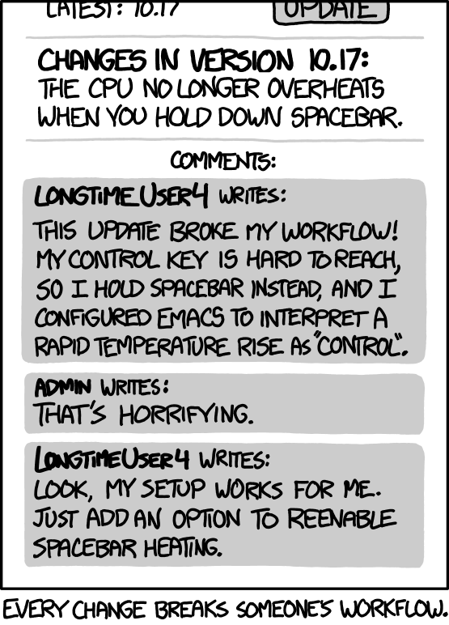

Let's start with the paper
--------------------------

**Retrofitting Parallelism onto OCaml**, ICFP 2020

- A modern, high-performance multi-core GC for OCaml
- Easy to maintain, easy to adopt.
  - One runtime for parallel and sequential
  - Preserving sequential performance, pause times, FFI

Lots of benchmarks and evaluation!

- Runtime loss of ~3% for sequential programs
- Memory used is similar
- Pause times very similar
- Good speedups

It did take a while, though...
-------

<!-- incremental_lists: false -->
<!-- pause -->

- 2013: OCaml Multicore project born
- 2015: "Effect Handlers for OCaml"
  presented at OCaml Workshop
- 2019: Sandmark benchmark suite created
- 2020: "Retrofitting Parallelism onto OCaml" published
- 2020: Core team commits to upstreaming multicore
- 2021: "Retrofitting Effect Handlers to OCaml" published
- 2022: OCaml 5.0 released with multicore GC and effects

<!-- pause -->

- 2023-09: prefetching restored (5.1)
- 2023-11: OCaml 5.1 merged to JS branch, w/both runtimes
- 2023-12: JS benchmarks find serious
  performance regressions
- 2024-05: compaction restored (5.2)
- 2025-01: statmemprof restored (5.3)
- 2025-05: Regressions fixed, multicore is GA at JS

Runtime 4
---------

- **Sequential**
- **Generational**
  - **Major heap** mark and sweep
  - **Minor heap** simple, fast bump allocator, w/promotion
  - **Write barrier** to detect back-pointers
- **Mark and Sweep** Collector
  - **Mark**: Start from the roots, mark all reachable objects
  - **Sweep**: Walk over the heap, collect all unreached objects
- **Incremental**
- **Snapshot-at-the-beginning** invariant

Runtime 5
---------

- ~~Sequential~~ Parallel
  - With stop-the-world phases and safe-points
- Minor heap
  - One minor heap per core
  - Stop-the-world collection
- Major heap
  - Shared heap
  - Merged mark/sweep design
  - Stop-the-world sync at cycle end

GC Colors in Runtime 4
----------------------
<!-- pause -->

## Marking

<!-- pause -->

## Sweeping

GC Colors in Runtime 5
-------------------

<!-- pause -->

## Marking

<!-- pause -->

## Sweeping

<!-- pause -->

## Cycle end

Regressions
-----------

- Some programs running 10-20% slower
- Some programs using 10-20% more memory

# Sources

- GC pacing problems
- Transparent huge-pages not getting allocated
- Slow context switching in systhreads
- Slow stack checks
- General lack of optimization in new code

Pacing in Runtime 4
-------------------

<!-- pause -->
**Heap**

- Tuned via `space_overhead`, percentage of space that's wasted
- Based on **steady state assumption**
- => Constant amount of collection per word promoted.

**Off-heap**

- `extra_heap_resources` determines when to do an extra cycle
- Increment by `N/kH` on every off-heap alloc
  - `N` - amount allocated
  - `H` - size of heap
  - `k` - some constant

Open-loop and Closed-loop pacing
--------------------------------

<!-- pause -->
# Open-loop

Predictable, but has a hard time hitting the target

<!-- pause -->
# Closed-loop

Can hit the target precisely, but often oscillates or converges too
slowly

<!-- pause -->

Heap pacing is open-loop, off-heap pacing is closed-loop.

GC Pacing Results
-----------------

GC Pacing Results (rt4)
-----------------

Pacing in Runtime 5
-------------------

- Same pacing approach for ordinary allocations
- Fixed a bunch of implementation bugs w.r.t off-heap memory

GC Pacing Results (rt4)
-----------------

GC Pacing Results (rt5)
-----------------

What happened?
--------------

- Ordinary collection is less aggressive
  - Unified mark & sweep => too much floating garbage (~40%)
  - Fix with markdelay patch, breaking them back up
- But excessive collection with bigstrings is better
  - One bugfix made allocation less aggressive
  - (But others made it more aggressive)

GC Pacing Results (rt5)
-----------------

GC Pacing Results (rt5-markdelay)
-----------------

What next?
----------

- Tried to fix some of the design bugs
- e.g., `N/kH` uses the wrong notion of `H`
- But...results were hard to tune and control

Back to the drawing board!
--------------------------

- Rethinking the steady-state analysis, an open-loop solution was
  found!
  - Constant number of words collected per word allocated
  - But an extra word of sweeping per on-heap byte

GC Pacing Results (rt5-markdelay)
-----------------

GC Pacing Results (rt5-open-loop)
-----------------

Things we learned
-----------------
<!-- incremental_lists: false -->
<!-- pause -->

# Benchmarking is hard

- Original testing leaned too much on small programs
- Different use-cases put different pressures on the design
- **Takeaway**: More of the initial
  evaluation should have been real systems.

<!-- pause -->
# Performance debugging is hard

- Problems cover each other
- Too much time spent implementing full solutions to non-problems
- **Takeaway**: More focused
  benchmarks and proof-of-concept fixes while iterating on the
  solutions

Things we learned
-----------------
<!-- incremental_lists: false -->

# Go back to the drawing board, sometimes

- We knew off-heap memory handling was hacky
- We tried to fix the issues incrementally
- But a first-principles approach turned out better

Things we learned
-----------------
<!-- incremental_lists: false -->

<!-- column_layout: [3, 2] -->

<!-- column: 0 -->
# Backwards compatibility is hard

Every change breaks someone's workflow.

<!-- column: 1 -->

What's next?
------------

<!-- pause -->

**Data Race Freedom à la Mode**, POPL
2025

- Propagating type information through our libraries
  - And fixing data-races!
- High-performance data-structures
- User-level scheduling
- Profiling and analysis tools
- New abstractions for efficiently combining parallelism and
  concurrency
- Teaching people how to use it!

Stay tuned!
