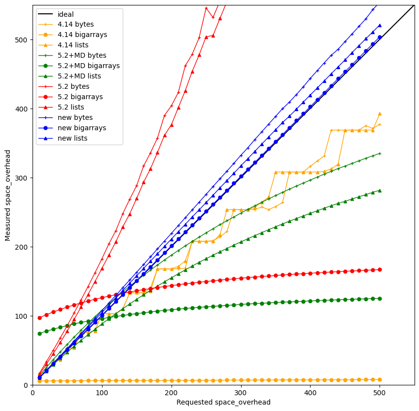

Goals
-----

- Build a modern, high-performance multicore GC for OCaml
- In a way that's easy to adopt! So...
    - Single, easy-to-maintain runtime
    - Don't break sequential performance
    - Maintain low pause times
    - Good parallel speedups

**Retrofitting Parallelism onto OCaml**, ICFP 2020

History
-------

- 2013: OCaml Multicore project born
- 2015: "Effect Handlers for OCaml" presented at OCaml Workshop
- 2019: Sandmark benchmark suite created
- 2020: "Retrofitting Parallelism onto OCaml" published
- 2020: Core team commits to upstreaming multicore
- 2021: "Retrofitting Effect Handlers to OCaml" published
- 2022: OCaml 5.0 released with Multicore GC!

9 years! But at least it's done.

Or is it?
----------

- 2023-09: OCaml 5.1 released w/prefetching restored
- 2023-11: OCaml 5.1 merged to JS branch, w/both runtimes
- 2023-12: JS benchmarks find serious performance regressions
- 2024-05: OCaml 5.2 released w/compaction restored
- 2025-01: OCaml 5.3 released w/statmemprof restored
- 2025-05(?): Runtime5 made GA at Jane Street

Another 2.5 years! What happened?

<!-- pause -->

And in particular, what about
**the 1.5 years from 2023-12 to 2025-05?**

What is OCaml's GC like?
------------------

<!-- column_layout: [1, 1] -->

<!-- pause -->
<!-- column: 0 -->
# Runtime 4

- Sequential
- Generational
- Incremental
- Closed-loop pacing via a steady-state analysis
- Tuned by space-overhead
- Supporting external memory

<!-- column: 1 -->
# Runtime 5

- ~~Sequential~~ Parallel
- Shared major heap
- One minor heap per domain
- Merged mark/sweep design
- With one (brief) stop-the-world sync per mark/sweep cycle

What slowed us down
-------------------

- Missing features (prefetching, statmemprof, compaction)
- Large time-performance regressions: 10-20% on GC-intense programs
  - And not just us! Other major users had hit similar slowdowns
- Material slowdowns (10%) on GC-free applications (!?!)

# What were the problems?

- Stack checks were expensive
- Transparent huge-pages weren't working
- Context switching in systhreads were slow
- GC pacing was off

GC Pacing
---------

GC Pacing Results
-----------------

<!-- pause -->

Performance debugging is hard
-------------

Project management is hard
-------------

Deployment is hard
-------------

Backwards compatibility is hard
-------------------------------

<!-- pause -->

Every change breaks someone's workflow.

