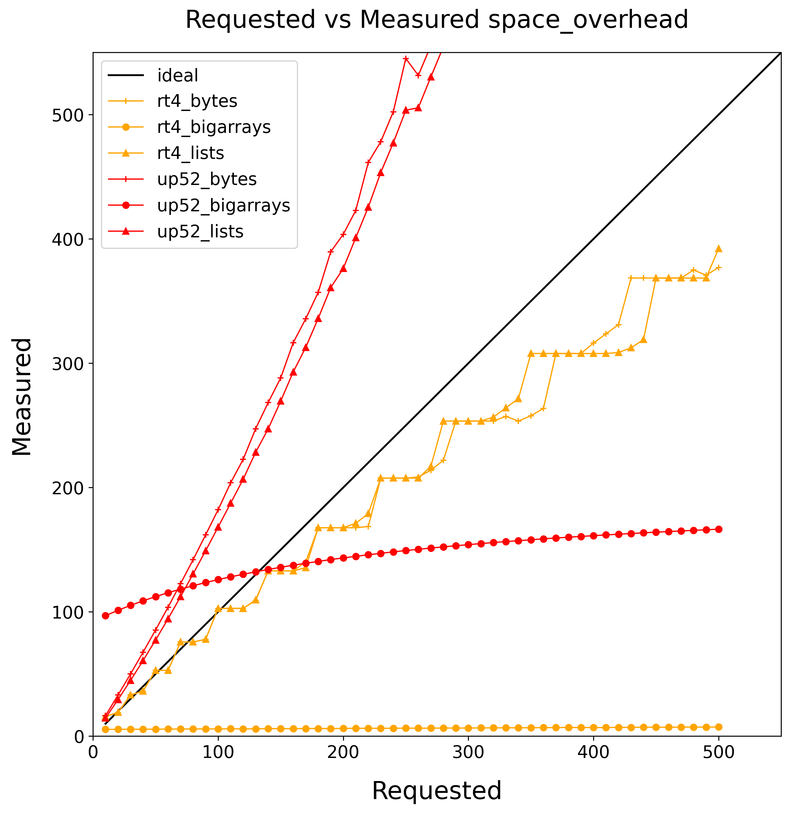
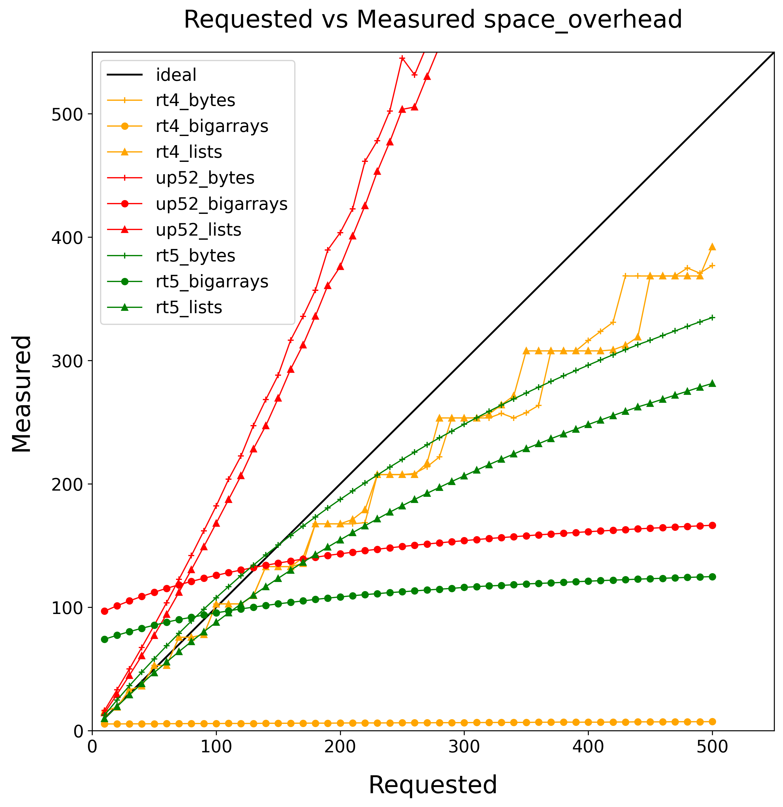
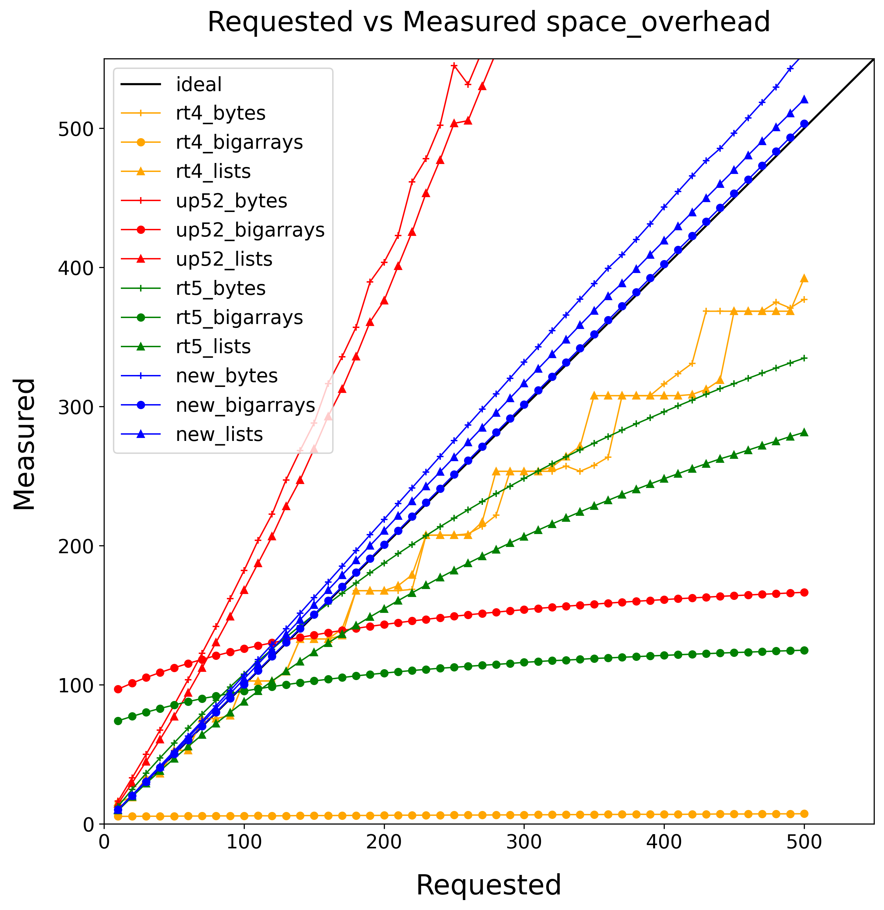

Goals
-----

- Build a modern, high-performance multicore GC for OCaml
- Single, easy-to-maintain runtime
- Good parallel speedups
- That's easy to adopt!
  - Preserving seuqential performance, pause times, FFI

**Retrofitting Parallelism onto OCaml**, ICFP 2020

<!-- speaker_note: The results are pretty good! -->

Lots of benchmarks!

- Performance loss of ~3% for sequential programs
- Pause times very similar
- Memory sizes similar-or-better
- Good speedups

It did take a while, though...
-------

<!-- incremental_lists: false -->
<!-- pause -->

- 2013: OCaml Multicore project born
- 2015: "Effect Handlers for OCaml"
  presented at OCaml Workshop
- 2019: Sandmark benchmark suite created
- 2020: "Retrofitting Parallelism onto OCaml" published
- 2020: Core team commits to upstreaming multicore
- 2021: "Retrofitting Effect Handlers to OCaml" published
- 2022: OCaml 5.0 released with Multicore GC and Effects

<!-- pause -->

9 years! But at least it's done.

Or is it?
----------

<!--
- 2023-09: OCaml 5.1 released w/prefetching restored
- 2023-11: OCaml 5.1 merged to JS branch, w/both runtimes
- 2023-12: JS benchmarks find serious performance regressions
- 2024-05: OCaml 5.2 released w/compaction restored
- 2025-01: OCaml 5.3 released w/statmemprof restored
- 2025-05(?): Runtime5 made GA at Jane Street
-->

- 2023-11: OCaml 5.1 merged to JS branch, w/both runtimes
- 2023-12: JS benchmarks find serious performance regressions
- 2025-05(?): Runtime5 made GA at Jane Street

What is OCaml's GC like?
------------------

<!-- column_layout: [1, 1] -->

<!-- pause -->
<!-- column: 0 -->
# Runtime 4

- Sequential
- Incremental
- Generational
- Snapshot-at-the-beginning
- With a write-barrier
- Closed-loop pacing via a steady-state analysis
- Tuned by space-overhead
- Supporting external memory

<!-- column: 1 -->
# Runtime 5

- ~~Sequential~~ Parallel
- Minor heap
  - One minor heap per domain
  - stop-the-world collection
- Major heap
  - Shared heap
  - Merged mark/sweep design
  - Stop-the-world sync at cycle end
- Safe-points

What problems did we encounter?
-------------------

- Missing features (prefetching, statmemprof, compaction, ...)
- 10-20% regressions on GC-intense programs
- 10% regressions on zero-allocation applications

# What were the causes?

- Transparent huge-pages weren't working
- Context switching in systhreads were slow
- GC pacing was off
  - Due to changes to mark/sweep design
  - and bad heuristics for external memory

Transparent Huge Pages
----------------------

<!-- incremental_lists: false -->
<!-- pause -->

Background

- Traditional pages are 4kb, "Huge" pages are 2Mb (or 1GB)
- Huge savings in TLB pressure
- **Transparent** huge pages is when the OS does it for you,
  implicitly

<!-- pause -->
What happened?

- Worked in 4.14, failed under 5.0
- Serious effect, 3x slowdown in pathological benchmark

What happened to our hugepages?
---------------------------

<!-- speaker_note: And why does the old GC (invented before THP)
     outperform the new one? -->

<!-- column_layout: [1, 1] -->
<!-- pause -->

<!-- column: 0 -->

# Runtime 4

- Grow in big chunks
- Compaction into one big space
- No clever virtual-memory games

<!-- column: 1 -->

# Runtime 5

- Grows in small increments
- Compaction into 32k chunks
- Guard pages to break up the minor heap

<!-- reset_layout -->

# Solution

- Grow heap in big chunks instead
- Compact into one big region
- Carefully align minor heaps

GC Pacing Problems
------------------

- Lots of programs consuming more memory (20%)
- Programs using lots of external memory seeing large slowdowns

How does pacing work?
---------------------

<!-- column_layout: [1, 1] -->
<!-- pause -->

<!-- column: 0 -->

# Runtime 4

- Constant amount of collection per word promoted.
- External memory
  - Mix of design and implementation bugs
  - Design bugs => mostly more aggressive
  - Impl bugs   => mostly less aggressive

<!-- column: 1 -->

# Runtime 5

- Same pacing approach for ordinary allocations
- Unified mark & sweep
- Fixed a bunch of implementation bugs

GC Pacing Results
-----------------

GC Pacing Results (rt4)
-----------------

GC Pacing Results (rt5)
-----------------

Markdelay
----------------------------------

- Unified mark & sweep => too much floating garbage
- Up to 25%!

GC Pacing Results (rt5)
-----------------

GC Pacing Results (rt5-markdelay)
-----------------

Open-loop pacing
-----------------

GC Pacing Results (rt5-markdelay)
-----------------

GC Pacing Results (rt5-open-loop)
-----------------

Backwards compatibility is hard
-------------------------------

<!-- pause -->

Every change breaks someone's workflow.

